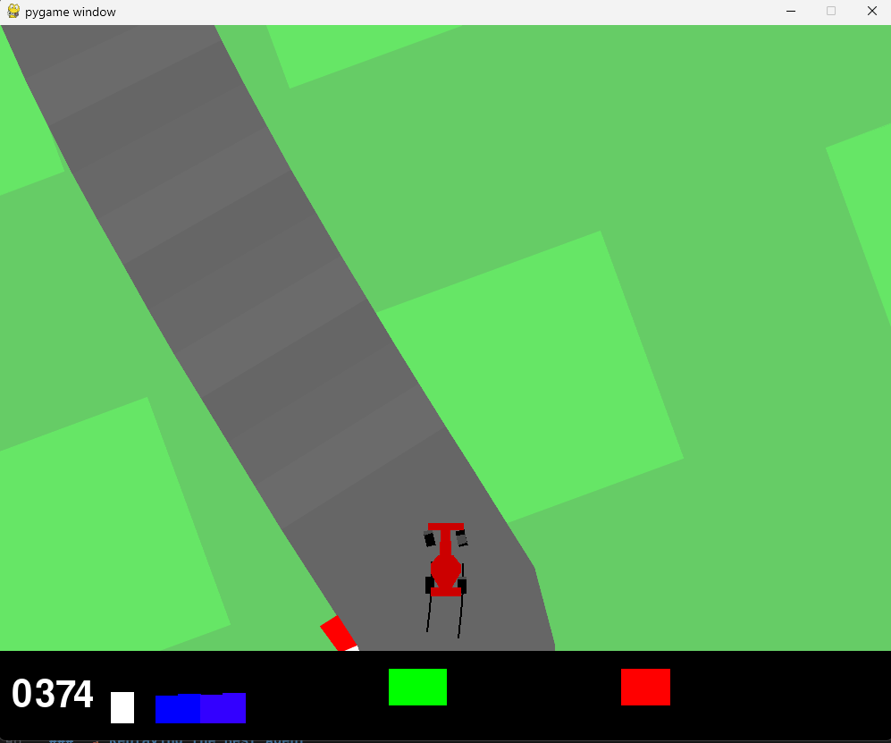
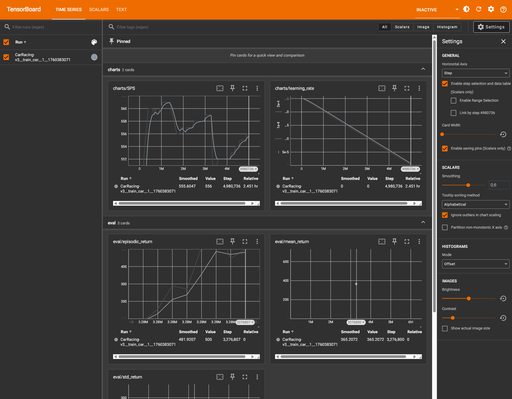

# Reinforcement Learning: CarRacing-v3 (PPO + CNN)



This repository contains an implementation of Proximal Policy Optimization (PPO) applied to the Gymnasium `CarRacing-v3` continuous control environment. The agent is trained using only pixel observations.

## Architecture & Implementation Details

### Observation Preprocessing
- The environment provides RGB frames.
- Frames are converted to grayscale to reduce input dimensionality.
- 4 consecutive frames are stacked to provide temporal context (velocity and acceleration).
- The final observation space shape is `(4, 96, 96)`.

### Policy Network (CNN)
The agent uses a Convolutional Neural Network to extract spatial features from the stacked frames:
- 3 Convolutional layers (`Conv2d`) followed by ReLU activations.
- A flattened dense layer of 512 units.
- **Actor Head:** Outputs the mean for a Normal distribution across 3 continuous actions (steering, gas, brake). Log standard deviation is maintained as a separate learnable parameter.
- **Critic Head:** Outputs a scalar value estimate for the current state, used for Generalized Advantage Estimation (GAE).

### Training Configuration
- **Algorithm:** Proximal Policy Optimization (PPO)
- **Optimizer:** Adam with learning rate annealing
- **Objective:** Clipped surrogate objective to bound policy updates
- **Base:** The implementation structure is adapted from the CleanRL framework, favoring a single-file script for the core training logic to simplify reproducibility.

---

## Experiment Tracking



Training metrics, including learning rate, losses, episodic returns, and FPS, are logged locally using TensorBoard. 

To launch the dashboard:
```bash
uv run tensorboard --logdir runs
```

---

## Usage

This project relies on Python 3.12+ and the [uv](https://github.com/astral-sh/uv) package manager.

### Running Tests
Verify the environment and dependencies:
```bash
uv run python -m pytest
```

### Evaluation / Replay
To evaluate the best trained checkpoint and generate video recordings:
```bash
uv run python replay_best_auto.py
```

### Training
To train a new policy from scratch:
```bash
uv run python train_car.py --total-timesteps 250000 --save-best-checkpoints
```

### Video Indexing
To generate an HTML table of recorded evaluation runs (useful for comparing different checkpoints):
```bash
uv run python video_index.py
```
This generates `videos/index.html`.
